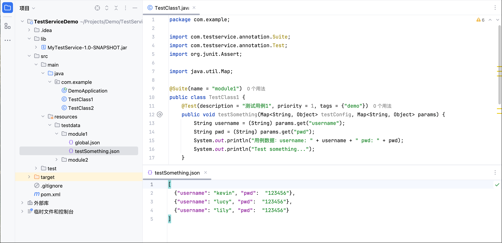

# TaaS

Test as a Service


## 使用方法
1. 打包本项目，得到`MyTestService-1.0-SNAPSHOT.jar`
2. 新建一个 Spring Boot应用，将 jar包拷贝到其 lib目录下，
3. 修改 Maven 配置，添加本地依赖MyTestService，及所依赖的junit、fastjson、reflections，例如：
```xml
<?xml version="1.0" encoding="UTF-8"?>
<project xmlns="http://maven.apache.org/POM/4.0.0"
         xmlns:xsi="http://www.w3.org/2001/XMLSchema-instance"
         xsi:schemaLocation="http://maven.apache.org/POM/4.0.0 http://maven.apache.org/xsd/maven-4.0.0.xsd">
    <modelVersion>4.0.0</modelVersion>

    <groupId>org.example</groupId>
    <artifactId>TestServiceDemo</artifactId>
    <version>1.0-SNAPSHOT</version>
    <properties>
        <maven.compiler.source>8</maven.compiler.source>
        <maven.compiler.target>8</maven.compiler.target>
        <project.build.sourceEncoding>UTF-8</project.build.sourceEncoding>
    </properties>
    <dependencies>
        <dependency>
            <groupId>org.springframework.boot</groupId>
            <artifactId>spring-boot-starter-web</artifactId>
            <version>2.7.18</version>
        </dependency>
        <dependency>
            <groupId>junit</groupId>
            <artifactId>junit</artifactId>
            <version>4.12</version>
            <scope>compile</scope>
        </dependency>
        <dependency>
            <groupId>org.reflections</groupId>
            <artifactId>reflections</artifactId>
            <version>0.10.2</version>
        </dependency>
        <dependency>
            <groupId>org.example</groupId>
            <artifactId>MyTestService</artifactId>
            <version>1.0-SNAPSHOT</version>
            <scope>system</scope>
            <systemPath>${project.basedir}/lib/MyTestService-1.0-SNAPSHOT.jar</systemPath>
        </dependency>
        <dependency>
            <groupId>com.alibaba</groupId>
            <artifactId>fastjson</artifactId>
            <version>1.2.83</version> <!-- 请根据需要选择最新版本 -->
        </dependency>
    </dependencies>
</project>
```
4. 在 Spring Boot 应用上添加`@TestService`，及相关导入。
```java
package com.example;

import com.testservice.annotation.TestService;
import org.springframework.boot.SpringApplication;
import org.springframework.boot.autoconfigure.SpringBootApplication;

@TestService
@SpringBootApplication
public class DemoApplication {
    public static void main(String[] args) {
        SpringApplication.run(DemoApplication.class, args);
    }
}
```
5.编写用例
```java
package com.example;

import com.testservice.annotation.Suite;
import com.testservice.annotation.Test;
import org.junit.Assert;

import java.util.Map;

@Suite(name = "module1")
public class TestClass1 {
    @Test(description = "测试用例1", priority = 1, tags = {"demo"})
    public void testSomething(Map<String, Object> testConfig, Map<String, Object> params) {
        String username = (String) params.get("username");
        String pwd = (String) params.get("pwd");
        System.out.println("用例数据：username: " + username + " pwd: " + pwd);
        System.out.println("Test something...");
    }
}
```
6. 设置用例数据
在 resources/testdata/下创建Suite name同名模块，如 module1，在下面创建 global.json 及用例方法同名数据文件，如 testSomething.json，如下图：



7. 运行用例
部署或启动你的 Spring Boot 服务，如 localhost:8080
使用以下接口运行用例：

- 运行单个用例：`/run/suites/{suite}/{testcase}`
- 运行整个suite：`/run/suites/{suite}`

例如：

```shell
curl 'http://localhost:8080/run/suites/module1/testSomething'
{"suite":"module1","className":"com.example.TestClass1","method":"testSomething","startTime":1748416221528,"endTime":1748416221529,"status":"pass","errMsg":""}
```